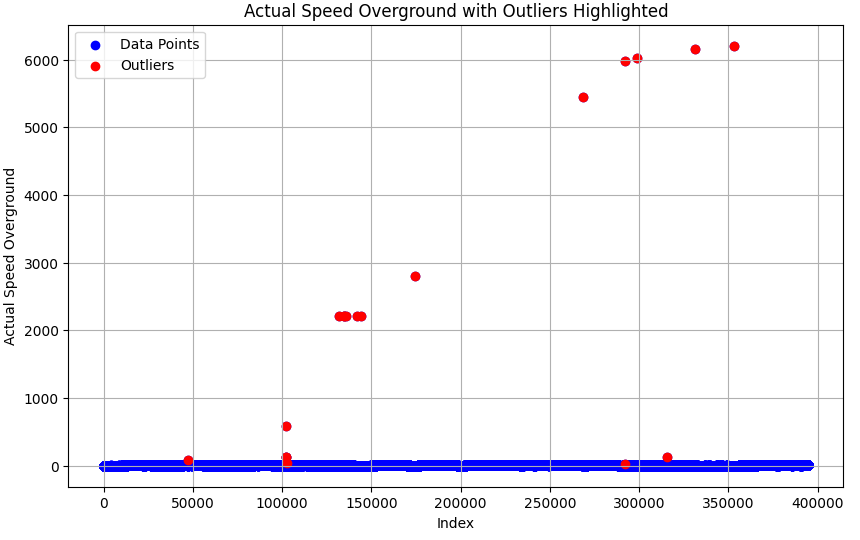

# Vessel Data Service

## Overview

The **Vessel Data Service** is a Spring Boot application designed to manage and analyze vessel data.
It provides various endpoints to process CSV files with metrics, retrieve speed differences, validate vessel
data, and identify problematic data. The application uses MySQL for persistent storage and H2 for
in-memory testing.

## Features

- Process CSV files containing vessel data.
- Retrieve speed differences for specific vessels.
- Validate vessel data and return invalid reasons.
- Compare compliance between two vessels.
- Identify problematic data based on specified criteria.

## Technologies Used

- **Java 21**
- **Spring Boot** (with Spring Web, Spring Data JPA, Spring Validation)
- **MySQL** (for production)
- **H2** (for testing)
- **JUnit 5**, **Mockito**, **MockMvc** (for unit testing)
- **Maven** (for dependency management)

## Getting Started

### Prerequisites

- Java 17 or higher
- Maven
- MySQL Server (for production)
- H2 Database (for testing)

### Installation

1. **Clone the repository:**

```
git clone https://github.com/yourusername/vessel-data-service.git
cd vessel-data-service
```

2. **Configure the database:**

- Update the `application.properties` file for production settings.
- Update the `application-test.properties` file for testing settings.

3. **Build the project:**

```
mvn clean install
```

4. **Run the application:**

```
mvn spring-boot:run
```
The application will start on `http://localhost:8080`.

## API Endpoints

### 1. Process CSV File

- **Endpoint:** `POST /api/vessels/processFile`
- **Description:** Processes the CSV file and inserts data into the database.
- **Response:** `200 OK` with a message indicating completion.

### 2. Get Speed Difference

- **Endpoint:** `GET /api/vessels/{vesselCode}/speed-difference`
- **Parameters:**
  - `latitude` (required): Latitude of the vessel.
  - `longitude` (required): Longitude of the vessel.
- **Response:** `200 OK` with a list of speed differences.

### 3. Get Speed Differences (Paginated)

- **Endpoint:** `GET /api/vessels/{vesselCode}/speed-differences`
- **Parameters:**
  - `page` (optional): Page number (default is 0).
  - `size` (optional): Number of items per page (default is 20).
- **Response:** `200 OK` with a paginated list of speed differences.

### 4. Get Invalid Reasons

- **Endpoint:** `GET /api/vessels/{vesselCode}/invalid-reasons`
- **Response:** `200 OK` with a list of invalid reasons for the specified vessel.

### 5. Compare Vessel Compliance

- **Endpoint:** `GET /api/vessels/compare-compliance`
- **Parameters:**
  - `vesselCode1` (required): First vessel code.
  - `vesselCode2` (required): Second vessel code.
- **Response:** `200 OK` with the compliance comparison result.

### 6. Get Vessel Data for Period

- **Endpoint:** `GET /api/vessels/{vesselCode}/data`
- **Parameters:**
  - `startDate` (required): Start date for the data retrieval.
  - `endDate` (required): End date for the data retrieval.
- **Response:** `200 OK` with a list of vessel data for the specified period.

### 7. Get Problematic Data

- **Endpoint:** `GET /api/vessels/{vesselCode}/problems`
- **Parameters:**
  - `invalidReason` (optional): Filter by invalid reason.
  - `overrideIntervalValue` (optional): Override interval value (default is 60).
  - `sizeThreshold` (optional): Size threshold (default is 10).
- **Response:** `200 OK` with a list of problematic data.

## Testing

### Running Tests

To run the tests, use the following command:

```
mvn test
```

### Test Coverage

The application includes unit tests for the controller and service layers, ensuring that all
functionalities are covered.

## Configuration

### Application Properties

- **Production Database Configuration:**

```
  spring.datasource.url=jdbc:mysql://localhost:3306/vessel_service_db?allowPublicKeyRetrieval=true&useSSL=false&serverTimezone=UTC
  spring.datasource.username=root
  spring.datasource.password=root
  
  spring.jpa.hibernate.ddl-auto=update
  spring.jpa.properties.hibernate.dialect=org.hibernate.dialect.MySQLDialect

  csv.file.name=static/vessel_data.csv
```

- **Testing Database Configuration:**

```
  spring.datasource.url=jdbc:h2:mem:vessel_service_db
  spring.datasource.driverClassName=org.h2.Driver
  spring.datasource.username=sa
  spring.datasource.password=password
  
  csv.file.name=vessel_data_min.csv
```

## Assumptions

- For last endpoint (GET Problematic Data) the following assumption was made: Datetime was used to determine the **consecutive waypoints**. Specifically, one hour continuous errors coming from the same vessel were considered to be part of the same problem. So, that's my consecutive waypoints concept. In the cluster, in the groups, microgroups of < 10 are ignored and work with bigger groups. These are default values and can be overriden by the controller.


- Utilizing Python Interquartile Range (IQR) Method, offline calculations took place to estimate **outlier** values of the dataset (see plot below).



Also, mysql queries, like following:
```
SELECT COUNT(*) AS count_above_20
FROM valid_vessel_data
WHERE CAST(actual_speed_overground AS DECIMAL) > 20;
```
- **actual_speed_overground > 20**

Applying same logic outlier values could also be:

- **proposed_speed_overground > 20**

